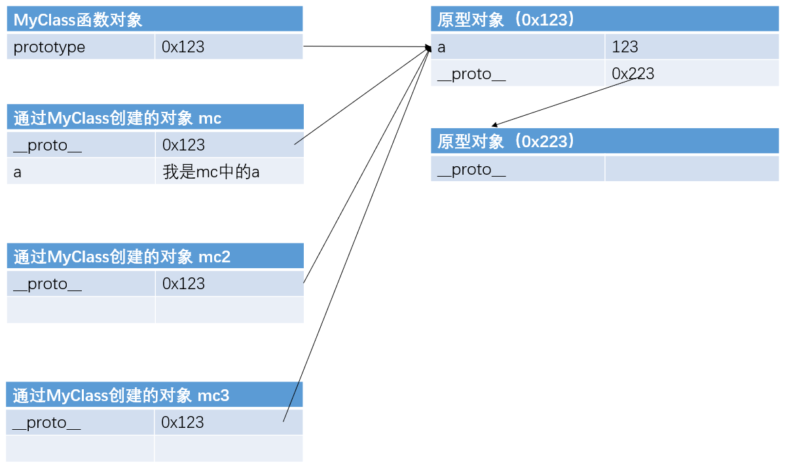

# 原型（prototype）
	- 创建一个函数以后，解析器都会默认在函数中添加一个数prototype
		prototype属性指向的是一个对象，这个对象我们称为原型对象。
	- 当函数作为构造函数使用，它所创建的对象中都会有一个隐含的属性执行该原型对象。
		这个隐含的属性可以通过对象.__proto__来访问。
	- 原型对象就相当于一个公共的区域，凡是通过同一个构造函数创建的对象他们通常都可以访问到相同的原型对象。
		我们可以将对象中共有的属性和方法统一添加到原型对象中，
			这样我们只需要添加一次，就可以使所有的对象都可以使用。
	- 当我们去访问对象的一个属性或调用对象的一个方法时，它会先自身中寻找，
		如果在自身中找到了，则直接使用。
		如果没有找到，则去原型对象中寻找，如果找到了则使用，
		如果没有找到，则去原型的原型中寻找，依此类推。直到找到Object的原型为止，Object的原型的原型为null，
		如果依然没有找到则返回undefined
	- hasOwnProperty()
		- 这个方法可以用来检查对象自身中是否含有某个属性
		- 语法：对象.hasOwnProperty("属性名")

# tostring()方法
```js
function Person(name , age , gender){
    this.name = name;
    this.age = age;
    this.gender = gender;
}
			
//修改Person原型的toString
Person.prototype.toString = function(){
    return "Person[name="+this.name+",age="+this.age+",gender="+this.gender+"]";
};
```
# 数组（Array）
    - 数组也是一个对象，是一个用来存储数据的对象
        和Object类似，但是它的存储效率比普通对象要高
    - 数组中保存的内容我们称为元素	
    - 数组使用索引（index）来操作元素
    - 索引指由0开始的整数
## 创建数组
    - var arr = new Array();
    - var arr = [];
    
## 向数组中添加元素
    - 语法；
    数组对象[索引] = 值;
    arr[0] = 123;
    arr[1] = "hello";
        
    - 创建数组时直接添加元素
    - 语法：
        var arr = [元素1,元素2....元素N];
        - 例子：
            var arr = [123,"hello",true,null];
                
## 获取和修改数组的长度
    - 使用length属性来操作数组的长度
    - 获取长度：
        数组.length
        - length获取到的是数组的最大索引+1
        - 对于连续的数组，length获取到的就是数组中元素的个数
    - 修改数组的长度
        数组.length = 新长度
            - 如果修改后的length大于原长度，则多出的部分会空出来
            - 如果修改后的length小于原长度，则原数组中多出的元素会被删除
    - 向数组的最后添加元素
        数组[数组.length] = 值;
            
## 数组的方法
    - push()
        - 用来向数组的末尾添加一个或多个元素，并返回数组新的长度
        - 语法：数组.push(元素1,元素2,元素N)
    - pop()
        - 用来删除数组的最后一个元素，并返回被删除的元素
    - unshift()
        - 向数组的前边添加一个或多个元素，并返回数组的新的长度
    - shift()
        - 删除数组的前边的一个元素，并返回被删除的元素
    - slice()
        - 可以从一个数组中截取指定的元素
        - 该方法不会影响原数组，而是将截取到的内容封装为一个新的数组并返回
        - 参数：
            1.截取开始位置的索引（包括开始位置）
            2.截取结束位置的索引（不包括结束位置）
                - 第二个参数可以省略不写，如果不写则一直截取到最后
            - 参数可以传递一个负值，如果是负值，则从后往前数
    - splice()
        - 可以用来删除数组中指定元素，并使用新的元素替换
            该方法会将删除的元素封装到新数组中返回
        - 参数：
            1.删除开始位置的索引
            2.删除的个数
            3.三个以后，都是替换的元素，这些元素将会插入到开始位置索引的前边
            
## 遍历数组
    - 遍历数组就是将数组中元素都获取到
    - 一般情况我们都是使用for循环来遍历数组：
        for(var i=0 ; i<数组.length ; i++){
            //数组[i]
        }
        
    - 使用forEach()方法来遍历数组（不兼容IE8）
    
        数组.forEach(function(value , index , obj){
        
        });
        
        forEach()方法需要一个回调函数作为参数，
            数组中有几个元素，回调函数就会被调用几次，
            每次调用时，都会将遍历到的信息以实参的形式传递进来，
            我们可以定义形参来获取这些信息。
            value:正在遍历的元素
            index:正在遍历元素的索引
            obj:被遍历对象
