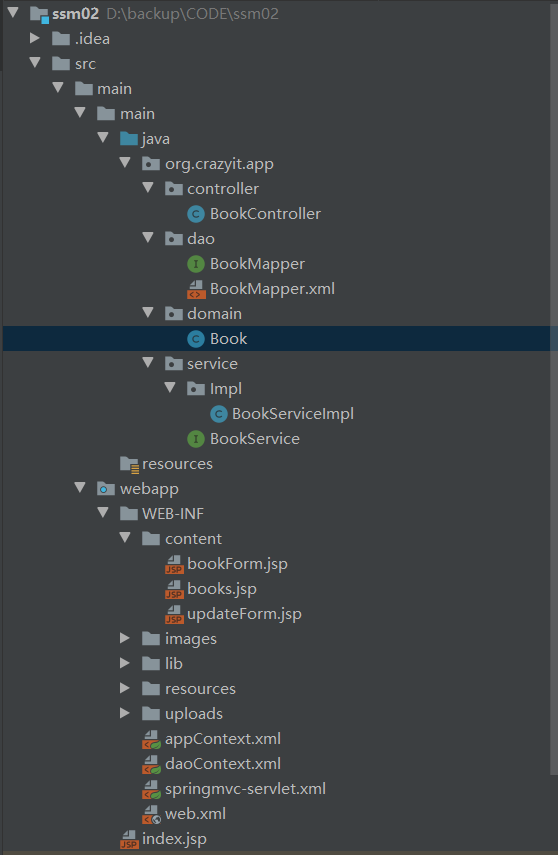

# 项目纪录
* 本次项目采用ssm整合, 模仿《疯狂java》案例制作而成
* 项目结构
    
# domain层
```java
public class Book {
    //唯一标识id
    private Integer id;
    @NotBlank(message = "图书名不允许为空")
    @Length(min=6, max=30, message = "书名长度必须为6~30个字符")
    private String title;
    @NotBlank(message = "作者名不允许为空")
    @Length(min=2, max = 10, message = "作者名长度必须为2~10个字符")
    private String author;
    @Range(min = 50, max = 200, message = "图书价格必须为50~200")
    private double price;
    //保存图片文件路径
    private String cover;
}
```
# DAO层
src\main\main\java\org\crazyit\app\dao\BookMapper.java
```java
public interface BookMapper
{
    Integer save(Book book);

    Book findById(int id);

    List<Book> findAll();

    Integer update(Book book);

    Integer delete(Integer id);

}
```
src\main\main\java\org\crazyit\app\dao\BookMapper.xml
```xml
<mapper namespace="org.crazyit.app.dao.BookMapper">
    <insert id="save" parameterType="org.crazyit.app.domain.Book">
		insert into book_inf values(null, #{title}, #{author}, #{price}, #{cover})
	</insert>
    <select id="findById" resultType="org.crazyit.app.domain.Book">
		select book_id id, book_title title, book_author author,
		book_price price, book_cover cover from book_inf where book_id=#{id}
	</select>
    <select id="findAll" resultType="org.crazyit.app.domain.Book">
		select book_id id, book_title title, book_author author,
		book_price price, book_cover cover from book_inf;
	</select>
    <update id="update" parameterType="org.crazyit.app.domain.Book">
		update book_inf set book_title=#{title},
		book_author=#{author}, book_price=#{price}
		where book_id=#{id};
	</update>
    <delete id="delete">
		delete from book_inf where book_id=#{id};
	</delete>
</mapper>
```
# Service层

src\main\main\java\org\crazyit\app\service\Impl\BookServiceImpl.java
```java
@Service("bookService")
@Transactional(propagation = Propagation.REQUIRED,
    isolation = Isolation.DEFAULT, timeout = 5)
public class BookServiceImpl implements BookService {

    @Resource(name = "bookMapper")
    private BookMapper bookMapper;

    /**
     * 
     * @param file 传入web端上传文件的各种信息
     * @param book book实例
     * @param attrs 用于之后的重定向的参数保存
     * @param requestFile 获取图片需要保存的路径
     * @return 返回是否成功上传图书信息的识别码
     * @throws IOException
     */
    @Override
    public Integer saveBook(MultipartFile file, Book book, RedirectAttributes attrs, String requestFile) throws IOException {
        // 保存图片的路径，图片上传成功后，将路径保存到数据库
        String filePath = requestFile;
        // 获取原始图片的扩展名
        String originalFilename = file.getOriginalFilename();
        // 生成文件新的名字
        String newFileName = UUID.randomUUID() + originalFilename;
        // 封装上传文件位置的全路径
        File targetFile = new File(filePath, newFileName);
        file.transferTo(targetFile);

        // 保存到数据库
        book.setCover(newFileName);
        return bookMapper.save(book);

    }

    @Override
    public Book getBook(Integer id) {
        return bookMapper.findById(id);
    }

    @Override
    public List<Book> getAllBooks() {
        return bookMapper.findAll();
    }

    @Override
    public Integer updateBook(Book book) {
        return bookMapper.update(book);
    }

    @Override
    public Integer deleteBook(Integer id) {
        return bookMapper.delete(id);
    }
}
```
# Controller层
src\main\main\java\org\crazyit\app\controller\BookController.java
```java
@Controller
public class BookController {

    @Resource(name = "bookService")
    private BookService bookService;

    // 啥都不用做，触发对web层对book参数的传递
    @GetMapping("/bookForm")
    public void bookForm(Book book) {

    }

    // 获取图书列表信息
    @GetMapping("/books")
    public void books(Model model) {
        model.addAttribute("books", bookService.getAllBooks());
    }

    //更新图书信息
    @GetMapping("/updateForm")
    public void updateForm(Integer id, Model model) {
        model.addAttribute("book", bookService.getBook(id));
    }

    // 删除图书信息
    @GetMapping("/deleteBook")
    public String deleteBook(Integer id, RedirectAttributes attrs) {
        Integer count = bookService.deleteBook(id);
        if (count > 0) {
            attrs.addFlashAttribute("tip", "图书删除成功");
        } else {
            attrs.addFlashAttribute("tip", "图书删除失败，请您重新尝试");
        }
        return "redirect:books";
    }

    /**
     * 
     * @param file 传入需要上传的文件的各种信息
     * @param book 把网页表单中的信息注入book实例中
     * @param bindingResult 统计错误（没按要求填写好）的信息个数
     * @param attrs 重定向参数
     * @param request 获取request参数
     * @return 返回对应的jsp页面
     * @throws IOException
     */
    @PostMapping("/addBook")
    public String addBook(@RequestParam("file") MultipartFile file, Book book, BindingResult bindingResult, RedirectAttributes attrs,
                          ServletRequest request) throws IOException {
        if (bindingResult.getErrorCount() > 0) {
            return "bookForm";
        }
        String requestFile = request.getServletContext().getRealPath("/WEB-INF/uploads/");
        Integer id = bookService.saveBook(file, book, attrs, requestFile);
        if (id > 0) {
            attrs.addFlashAttribute("tip", "图书添加成功");
            return "redirect:books";
        } else {
            attrs.addFlashAttribute("tip", "图书添加失败，请您重新添加");
            return "redirect:bookForm";
        }
    }

    // 更新书本信息
    @PostMapping("/updateBook")
    public String updateBook(@Validated Book book, BindingResult bindingResult, RedirectAttributes attrs) {
        if (bindingResult.getErrorCount() > 0) {
            return "updateForm";
        }
        Integer count = bookService.updateBook(book);
        if (count > 0) {
            attrs.addFlashAttribute("tip", "图书修改成功");
            return "redirect:books";
        } else {
            attrs.addFlashAttribute("tip", "图书修改失败，请您重新尝试");
            return "updateForm";
        }
    }
}
```